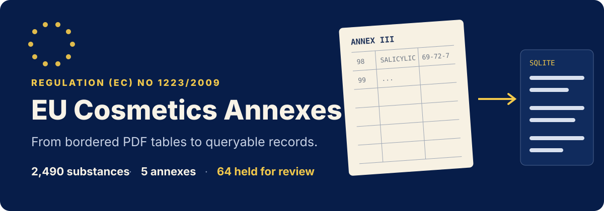

<p align="center">
  
</p>

<p align="center"><strong>English</strong> · <a href="./README.zh-CN.md">中文</a></p>

A reproducible extraction pipeline for Annexes II–VI of the consolidated English version of EU Cosmetics Regulation (EC) No 1223/2009 dated 18 May 2026. It reconstructs bordered PDF tables into queryable SQLite and CSV while preserving uncertain column pairings for human review instead of guessing.

## Dataset at a glance

| Annex | Subject | PDF pages | Entries | Substances | Conditions | Footnotes |
| --- | --- | ---: | ---: | ---: | ---: | ---: |
| II | Prohibited substances | 35–139 | 1,765 | 1,766 | — | 13 |
| III | Restricted substances | 140–384 | 392 | 411 | 629 | 47 |
| IV | Allowed colorants | 385–412 | 154 | 155 | 155 | 2 |
| V | Allowed preservatives | 413–428 | 62 | 121 | 75 | 22 |
| VI | Allowed UV filters | 429–439 | 37 | 37 | 40 | 10 |

The committed output contains **2,490 substance records**. Of these, 2,426 are clean one-to-one splits and 64 are retained in [`data/review_queue.csv`](./data/review_queue.csv) because the source columns cannot be paired safely.

Character-level coverage checks account for every character in the five table regions. The only difference from the source stream is intentionally removed soft hyphenation; there are no extra captured characters. See the complete [validation report](./docs/validation.md).

## Query immediately

The ready-to-use database is [`data/cosmetics_reg.sqlite`](./data/cosmetics_reg.sqlite).

```sql
-- Find a substance across annexes
SELECT annex, ref_no, inci_name, cas
FROM substances
WHERE cas = '69-72-7';

-- Inspect tiered restrictions for Annex III, entry 98
SELECT tier, product_type, max_conc_value, max_conc_unit
FROM conditions
WHERE annex = 'III' AND ref_no = '98'
ORDER BY tier_seq;
```

CSV exports are split by annex and table: `entries`, `substances`, `conditions`, and `footnotes`.

## Rebuild from EUR-Lex

Download the consolidated English PDF from [EUR-Lex](https://eur-lex.europa.eu/eli/reg/2009/1223/consolidated), then:

```bash
pip install pdfplumber pymupdf
export CELEX_PDF=/path/to/CELEX_02009R1223-20260518_EN_TXT.pdf
CELEX_OUT=./data python src/build.py II III IV V VI
CELEX_OUT=./data python src/coverage.py II III IV V VI
```

The pipeline expects document `02009R1223 — EN — 18.05.2026 — 041.001`, 449 pages.

## Extraction design

| Module | Responsibility |
| --- | --- |
| [`celex.py`](./src/celex.py) | Reconstructs cells from PDF border geometry |
| [`spec.py`](./src/spec.py) | Keeps a separate column mapping for each annex |
| [`split.py`](./src/split.py) | Splits substances and tiered conditions conservatively |
| [`build.py`](./src/build.py) | Assembles normalized records and writes SQLite / CSV |
| [`coverage.py`](./src/coverage.py) | Compares extracted cells against the raw PDF character stream |

No synthetic pairing is introduced when INCI, CAS, and EC columns have different counts. Those source strings are preserved together, `split_ok=0` is set, and the row is routed to review.

See [schema documentation](./docs/schema.md), [extraction notes](./docs/extraction-notes.md), and [validation details](./docs/validation.md).

## Legal note

The consolidated text is a reference copy; legally binding acts are published in the Official Journal of the European Union. Extracted regulatory text comes from EUR-Lex and is reused under Decision 2011/833/EU with source attribution. It is not covered by the repository's MIT license.

The extraction code is MIT licensed—see [LICENSE](./LICENSE).
