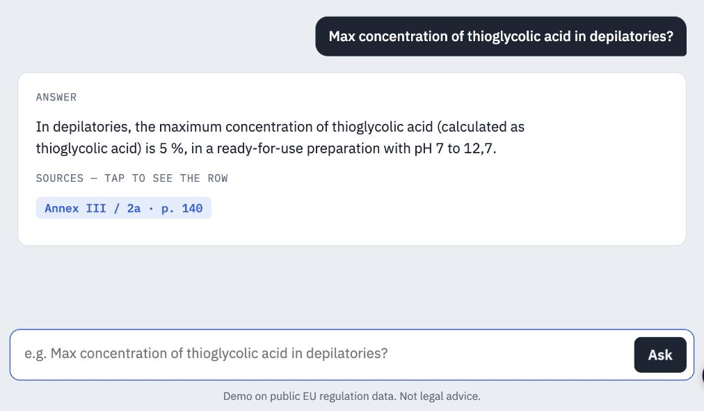

# Q&A demo on the extracted regulation data

A web page that answers questions about ingredient limits in Annexes II–VI of the EU Cosmetics Regulation (EC) No 1223/2009, using the data in [`../data`](../data). It answers in English, French or Chinese.

Every answer cites the annex, entry and PDF page it comes from, for example `Annex III / 2a · p. 140`. Tapping a citation shows the original row. Entries in `review_queue.csv` carry a "flagged for review" notice.

When the tables don't cover a question, the page says so instead of answering: a substance that isn't listed, another country's rules, or a request for safety or formulation advice.

## How it works

1. **Scope check.** Questions about other jurisdictions or asking for advice are refused before any model call.
2. **Lookup.** `engine.js` matches full substance names, INCI names, and CAS and EC numbers against the annex tables. If nothing matches, the model only maps the question to English substance names (for French and Chinese questions and trade names). If there is still no match, the page refuses.
3. **Answer from the rows found.** The model sees only the matching rows and must list the rows it used. The page draws the citation tags from those rows, not from the model's text.

## Accuracy

22 of 22 test questions pass on the live page, including 7 that must be refused. See [`accuracy-report.md`](accuracy-report.md) for every question, the one error found on the first run, and how it was fixed.

## Files

| File | Purpose |
| --- | --- |
| `index.html` | The page |
| `engine.js` | Lookup, scope check and citation labels (runs in the browser and in Node) |
| `build_index.py` | Builds `data.js` from `../data/cosmetics_reg.sqlite` |
| `data.js` | The annex tables as one compact file (2,410 entries) |
| `tests.json`, `test_retrieval.js` | Offline test of lookup and refusals: `node test_retrieval.js` (needs `data.json` from `build_index.py`) |
| `accuracy-report.md` | Live test results |

The page runs as a claude.ai artifact and uses the viewer's own Claude account to write answers.

Demo on public EU regulation data. Not legal advice.
